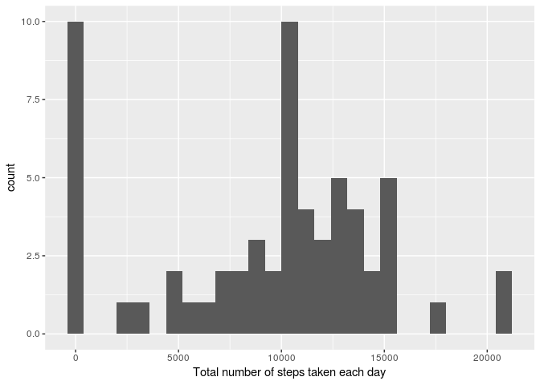
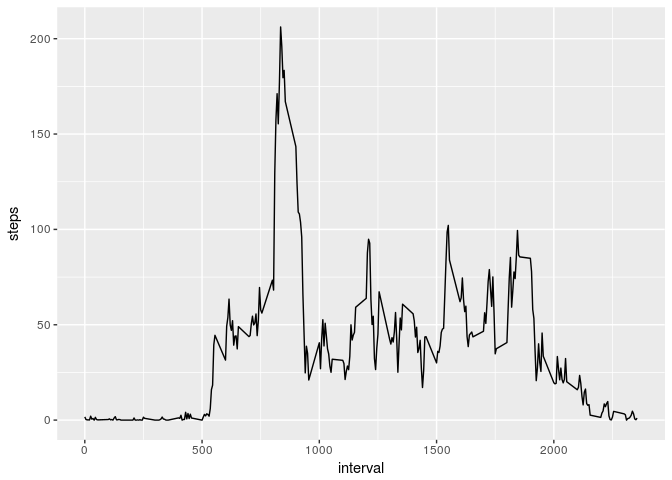
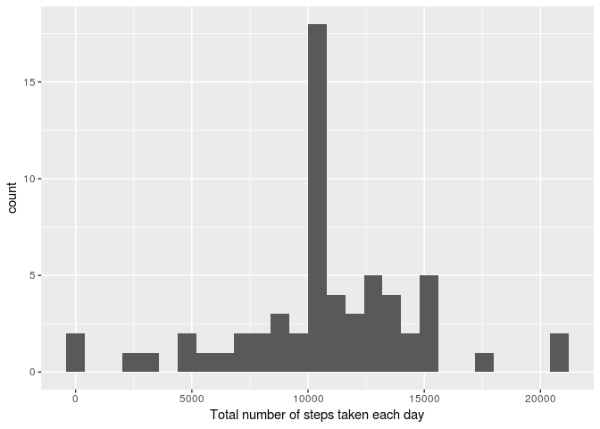
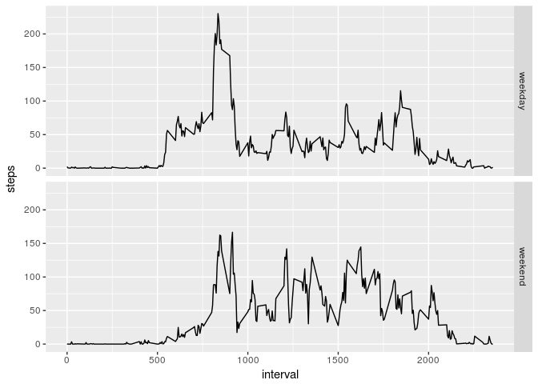

Loading and preprocessing the data
----------------------------------

``` r
if(!file.exists('activity.csv')){
    unzip('activity.zip')
}
df<-read.csv("activity.csv")
```

What is the mean total number of steps taken per day?
-----------------------------------------------------

``` r
library(ggplot2)
```

1.  The total number of steps taken per day is

``` r
totalnofsteps <- tapply(df$steps, df$date, FUN = sum, na.rm = TRUE)
```

1.  Histogram of the total number of steps taken each day:

``` r
qplot(totalnofsteps, xlab = "Total number of steps taken each day", binwidth=800)
```



1.  The mean and median number of steps per day are:

``` r
mean(totalnofsteps, na.rm=TRUE)
```

    ## [1] 9354.23

``` r
median(totalnofsteps, na.rm=TRUE)
```

    ## [1] 10395

What is the average daily activity pattern?
-------------------------------------------

1.  Times series plot of the 5-minute interval (x-axis) and the average number of steps taken, averaged across all days (y-axis)

``` r
ag<-aggregate(x=list(steps=df$steps),by=list(interval=df$interval),FUN=mean,na.rm=TRUE)
ggplot(data=ag, aes(x = interval, y = steps))+geom_line()
```



1.  The 5-minute interval which contains the maximum number of steps is

``` r
ag[which.max( ag$steps),1]
```

    ## [1] 835

Inputing missing values
-----------------------

1.  The total number of rows with NAs is:

``` r
sum(is.na(df$steps))
```

    ## [1] 2304

1.  Fill in the NAs with the mean for the corresponding 5-minute interval

We can iterate over the rows and if a step is NA, replace it with the mean correponding to the interval. We already computed the means (ag)

1.  Let's do it!

``` r
# make a copy of data
dfnoNA <- df
for (r in 1:nrow(df)){ # iterate over all rows of data
  if ( is.na(df$steps[r])) { # if step is NA
    interval <- df$interval[r] # get the corresponding interval
    # retrieve mean for the interval
    meanForInterval <- ag$steps[ag$interval == interval] 
    # fill in value
    dfnoNA$steps[r] <- meanForInterval
    }
  }
```

1.  Plot a histogram

``` r
totalnofsteps <- tapply(dfnoNA$steps, dfnoNA$date, FUN = sum, na.rm = TRUE)
qplot(totalnofsteps, xlab = "Total number of steps taken each day", binwidth=800)
```



The mean and median number of steps per day are now:

``` r
mean(totalnofsteps, na.rm=TRUE)
```

    ## [1] 10766.19

``` r
median(totalnofsteps, na.rm=TRUE)
```

    ## [1] 10766.19

The form of the histogram, as well as mean and median, are not much changed.

weekdays and weekends
---------------------

1.  Create a new factor variable in the dataset with two levels : weekday and weekend

``` r
# Set language to english
Sys.setlocale("LC_TIME", "C")
```

    ## [1] "C"

``` r
# add the new column
dfnoNA$daytype <- "weekday"
dfnoNA$daytype[weekdays(as.Date(dfnoNA$date)) %in% c("Saturday","Sunday")] <- "weekend"
# convert it to a factor
dfnoNA$daytype <- as.factor(dfnoNA$daytype)
```

1.  Panel plot

``` r
# recompute the means for both day type
agnoNA<-aggregate(x=list(steps=dfnoNA$steps),by=list(interval=dfnoNA$interval, daytype=dfnoNA$daytype),FUN=mean)
# plot as panel plot (with ggplot2)
ggplot(data=agnoNA, aes(x = interval, y = steps))+geom_line()+facet_grid(daytype ~ .)
```


